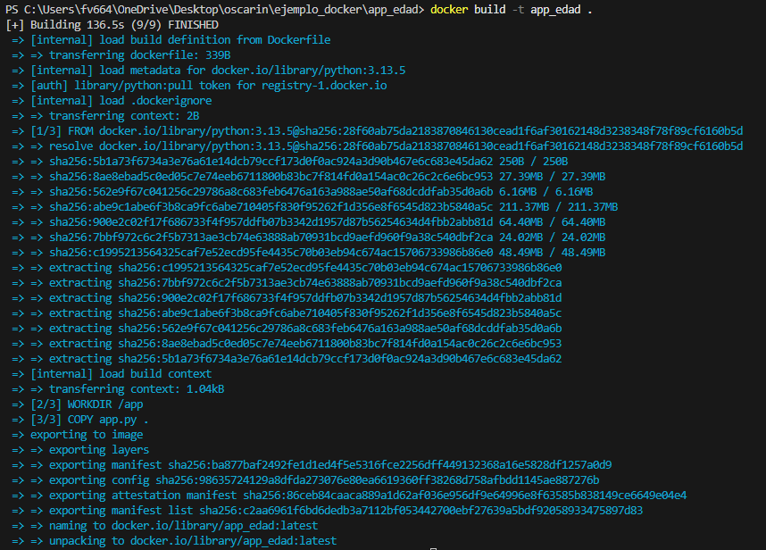
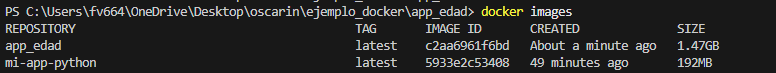
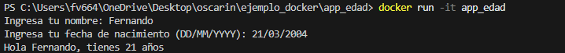
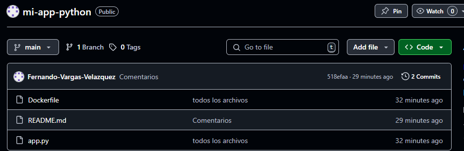

# Cración de una imagen

## Con una app en python que permite calcular la edad
```python

from datetime import datetime

# Pedir nombre
nombre = input("Ingresa tu nombre: ")

# Pedir fecha de nacimiento
fecha_str = input("Ingresa tu fecha de nacimiento (DD/MM/YYYY): ")

# Calcular edad
fecha_nacimiento = datetime.strptime(fecha_str, "%d/%m/%Y")
fecha_actual = datetime.now()
edad = fecha_actual.year - fecha_nacimiento.year

# Ajustar si no ha cumplido años este año
if (fecha_actual.month, fecha_actual.day) < (fecha_nacimiento.month, fecha_nacimiento.day):
    edad -= 1

# Mostrar resultado
print(f"Hola {nombre}, tienes {edad} años")

```

## Configuramos nuestro archivo Dockerfile

```Dockerfile

#usaremos una imagen base oficial de python

FROM python:3.13.5

#Establecer el directorio de trabajo dentro del contenedor

WORKDIR /app

#Copiar el archivo de la aplicación al contenedor 

COPY app.py .

#Comando a ejecutar al iniciar el contenedor 

CMD [ "python", "app.py" ]

```

## Creamos la imagen con la aplicación 


## Verificamos que exista la imagen 


# Ejecutramos la aplicación desde la imagen


# Ahora subimos todo a nuestro repositorio en github
* Antes de los cambios 


* Después de guarlo
